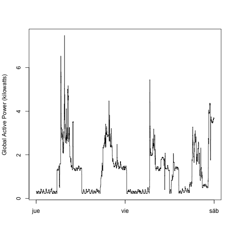
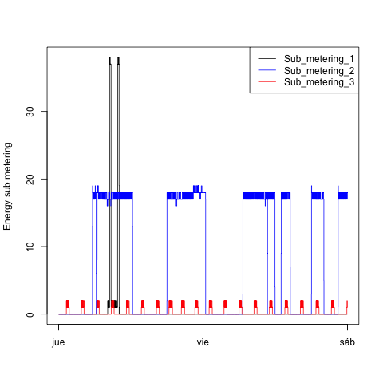
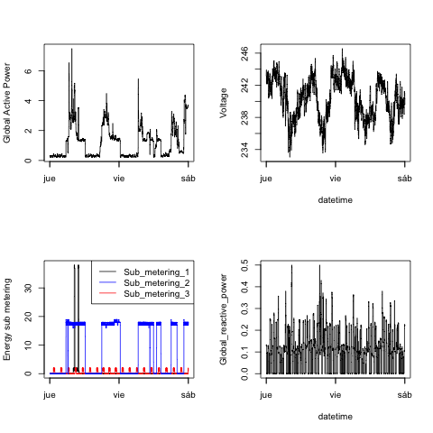

## Introduction
This is the fork repo for Exploratory Data Analysis Course as a part of the Data Science Specialization in Coursera.
The purpose of this project is to learn how to use the basic graphics system from R.

## Project
In this project you will find 4 R files and 4 png file each of them correspond to one of the R files.

In the case of plots that use Date and Time information, the week day names are in Spanish due a locale of the author.

## Plot 1

## Plot 2

## Plot 3

## Plot 4

